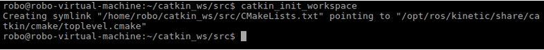
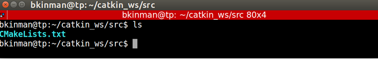
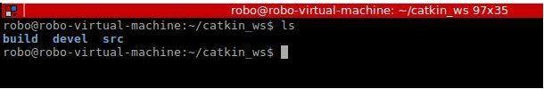
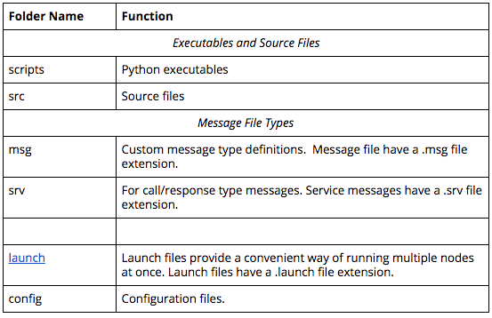

# Catkin Workspace for ROS(Robot Operation System)

ROS provides a powerful build and package management system called Catkin. Willow Garage (the early developers of ROS) named Catkin after the flowers on the willow trees surrounding their office. A Catkin workspace is essentially a directory where Catkin packages are built, modified and installed.

Similar to workspaces, which hold a wide variety of Catkin packages, Catkin packages are nothing more than directories containing a variety of resources which when considered together constitute some sort of useful module. Catkin packages may contain source code for nodes, useful scripts, configuration files and more.

In the sections you will see how to create a Catkin workspace, add packages to it, manage inner package dependencies and lastly, how to successfully compile everything.

# 1. Create a Catkin Workspace

#### Step 1: mkdir -p  ~/catkin_ws/src

All of the ROS related code you develop throughout this course will reside in your catkin workspace. You only need to create and initialize the workspace once.  First, create the top level catkin workspace directory and a sub-directory named **src** (pronounced source). The top level directory’s name is arbitrary, but is often called **catkin_ws** (an abbreviation of catkin_workspace), so we will follow this convention. You can create these two directories with a single command: 

	mkdir -p ~/catkin_ws/src

#### Step 2: cd ~/catkin_ws/src

Next, navigate to the src directory with the cd command:

	cd ~/catkin_ws/src

#### Step 3: catkin_init_workspace

Now you can initialize the catkin workspace:

	catkin_init_workspace

Let’s list the contents of the current directory to see what changed.

	ls -l
Notice that a symbolic link (**CMakeLists.txt**) has been created to **/opt/ros/kinetic/share/catkin/cmake/toplevel.cmake**

	
#### Step 4: cd ~/catkin_ws
Return to the top level directory:

	cd ~/catkin_ws

#### Step 5: catkin_make
build the workspace.
Note: you must issue this command from within the top level directory (i.e., within catkin_ws NOT catkin_ws/src)

	catkin_make

While it is not essential that you have a deep understanding of what the catkin build system is, particularly if you are doing most of your development work in Python, it is helpful to learn about it. The curious reader is encouraged to read the [ROS wiki](http://wiki.ros.org/catkin/conceptual_overview). After the command is executed you will notice the output of the build processes being echoed to your display. When it has finished you should see the following lines at the end of the output:

	-- BUILD_SHARED_LIBS is on
	-- Configuring done
	-- Generating done
	-- Build files have been written to: /home/robo/catkin_ws/build
	####
	#### Running command: "make -j2 -l2" in "/home/robo/catkin_ws/build"
	####
	robo@robo-virtual-machine:~/catkin_ws$

But what else has changed? Use the **ls** command again to see what is new.

	
You now have two new directories: **build** and **devel**. **The aptly named build directory is the build space for C++ packages** and for the most part you will not interact with it. **The devel directory does contain something of interest, a file named setup.bash**. This setup.bash script must be sourced before using the catkin workspace. 

#### Step 6: Commentary

You just created your first catkin workspace. Before you begin to work with and develop your own ROS package, you should take a moment to get acquainted with catkin workspace conventional directory structure.
ROS packages have a conventional directory structure. Let’s take a look at a more typical package. 
* scripts (python executables)
* src (C++ source files)
* msg (for custom message definitions)
* srv (for service message definitions)
* include -> headers/libraries that are needed as dependencies
* config -> configuration files
* launch -> provide a more automated way of starting nodes

Other folders may include

* urdf (Universal Robot Description Files)
* meshes (CAD files in .dae (Collada) or .stl (STereoLithography) format)
* worlds (XML like files that are used for Gazebo simulation environments)

 

	
More information is described in the ROS Enhancement Proposal (REP) 128: http://www.ros.org/reps/rep-0128.html

# 2. Add a Package

One of the biggest benefits of using ROS is that it has a really large community of users and developers, so there is a lot of code that you can use.  Let’s clone an existing package and add it to our newly created workspace.

You will start by navigating to the **src** directory and cloning the **simple_arm ** package for this lesson from its github repo.

	cd ~/catkin_ws/src
	git clone https://github.com/udacity/simple_arm_01.git simple_arm

#### Building the simple_arm package

After the repo has finished cloning, you can change directory to the top-level of the ros workspace and build the new package.

	 cd ~/catkin_ws
	 catkin_make
	 
If you  see a CMake Error "Could not find a package configuration file provided by controller_manager" you should install Missing Packages Using **apt-get**.

#### Installing Missing Packages Using apt-get 
Note: if you did not get any  CMake error, you do not to run this section. 

I happen to know that controller_manager refers to a ROS package from ROS Control. We can fix this by installing the associated Debian package. If I didn't already know this, I would probably have to rely on a Google search to figure out the exact name of the package required.

	sudo apt-get install ros-kinetic-controller-manager
	
Some students have had success using the following commands to install missing packages:

	source devel/setup.bash 
	rosdep install simple_arm
	
OK, now that we have the **controller-manager** package let’s try building again. I'm still in the top level directory, so I can just type **catkin_make** and hit enter. Looks like the build worked. Great, that wasn't so bad. Let’s run some of this code that we just cloned!

