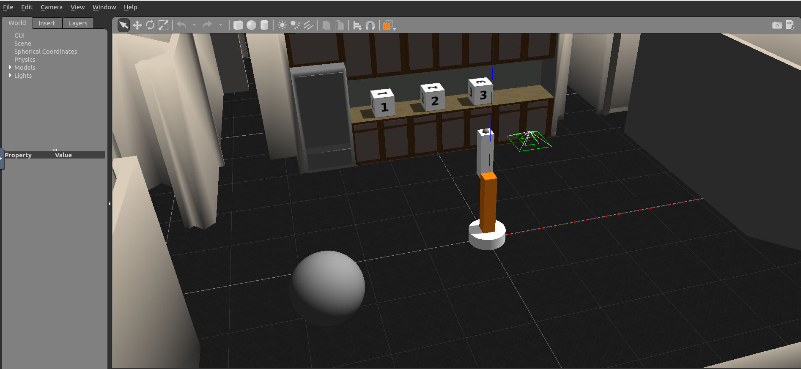
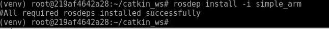

# Catkin Workspace for ROS(Robot Operation System)

ROS provides a powerful build and package management system called Catkin. Willow Garage (the early developers of ROS) named Catkin after the flowers on the willow trees surrounding their office. A Catkin workspace is essentially a directory where Catkin packages are built, modified and installed.

Similar to workspaces, which hold a wide variety of Catkin packages, Catkin packages are nothing more than directories containing a variety of resources which when considered together constitute some sort of useful module. Catkin packages may contain source code for nodes, useful scripts, configuration files and more.

In the sections you will see how to create a Catkin workspace, add packages to it, manage inner package dependencies and lastly, how to successfully compile everything.

# 1. Create a Catkin Workspace

#### Step 1: mkdir -p  ~/catkin_ws/src

All of the ROS related code you develop throughout this course will reside in your catkin workspace. You only need to create and initialize the workspace once.  First, create the top level catkin workspace directory and a sub-directory named **src** (pronounced source). The top level directory’s name is arbitrary, but is often called **catkin_ws** (an abbreviation of catkin_workspace), so we will follow this convention. You can create these two directories with a single command: 

	mkdir -p ~/catkin_ws/src

#### Step 2: cd ~/catkin_ws/src

Next, navigate to the src directory with the cd command:

	cd ~/catkin_ws/src

#### Step 3: catkin_init_workspace

Now you can initialize the catkin workspace:

	catkin_init_workspace

Let’s list the contents of the current directory to see what changed.

	ls -l
Notice that a symbolic link (**CMakeLists.txt**) has been created to **/opt/ros/kinetic/share/catkin/cmake/toplevel.cmake**

	
#### Step 4: cd ~/catkin_ws
Return to the top level directory:

	cd ~/catkin_ws

#### Step 5: catkin_make
build the workspace.
Note: you must issue this command from within the top level directory (i.e., within catkin_ws NOT catkin_ws/src)

	catkin_make

While it is not essential that you have a deep understanding of what the catkin build system is, particularly if you are doing most of your development work in Python, it is helpful to learn about it. The curious reader is encouraged to read the [ROS wiki](http://wiki.ros.org/catkin/conceptual_overview). After the command is executed you will notice the output of the build processes being echoed to your display. When it has finished you should see the following lines at the end of the output:

	-- BUILD_SHARED_LIBS is on
	-- Configuring done
	-- Generating done
	-- Build files have been written to: /home/robo/catkin_ws/build
	####
	#### Running command: "make -j2 -l2" in "/home/robo/catkin_ws/build"
	####
	robo@robo-virtual-machine:~/catkin_ws$

But what else has changed? Use the **ls** command again to see what is new.

	
You now have two new directories: **build** and **devel**. **The aptly named build directory is the build space for C++ packages** and for the most part you will not interact with it. **The devel directory does contain something of interest, a file named setup.bash**. This setup.bash script must be sourced before using the catkin workspace. 

#### Step 6: Commentary

You just created your first catkin workspace. Before you begin to work with and develop your own ROS package, you should take a moment to get acquainted with catkin workspace conventional directory structure.
ROS packages have a conventional directory structure. Let’s take a look at a more typical package. 
* scripts (python executables)
* src (C++ source files)
* msg (for custom message definitions)
* srv (for service message definitions)
* include -> headers/libraries that are needed as dependencies
* config -> configuration files
* launch -> provide a more automated way of starting nodes

Other folders may include

* urdf (Universal Robot Description Files)
* meshes (CAD files in .dae (Collada) or .stl (STereoLithography) format)
* worlds (XML like files that are used for Gazebo simulation environments)

 

	
More information is described in the ROS Enhancement Proposal (REP) 128: http://www.ros.org/reps/rep-0128.html

# 2. Add a Package

One of the biggest benefits of using ROS is that it has a really large community of users and developers, so there is a lot of code that you can use.  Let’s clone an existing package and add it to our newly created workspace.

You will start by navigating to the **src** directory and cloning the **simple_arm ** package for this lesson from its github repo.

	cd ~/catkin_ws/src
	git clone https://github.com/udacity/simple_arm_01.git simple_arm

#### Building the simple_arm package

After the repo has finished cloning, you can change directory to the top-level of the ros workspace and build the new package.

	 cd ~/catkin_ws
	 catkin_make
	 
If you  see a CMake Error "Could not find a package configuration file provided by controller_manager" you should install Missing Packages Using **apt-get**.

#### Installing Missing Packages Using apt-get 
Note: if you did not get any  CMake error, you do not to run this section. 

I happen to know that controller_manager refers to a ROS package from ROS Control. We can fix this by installing the associated Debian package. If I didn't already know this, I would probably have to rely on a Google search to figure out the exact name of the package required.

	sudo apt-get install ros-kinetic-controller-manager
	
Some students have had success using the following commands to install missing packages:

	source devel/setup.bash 
	rosdep install simple_arm
	
OK, now that we have the **controller-manager** package let’s try building again. I'm still in the top level directory, so I can just type **catkin_make** and hit enter. Looks like the build worked. Great, that wasn't so bad. Let’s run some of this code that we just cloned!

# 3. Roslaunch

Up until this point you've been launching nodes using the venerable Rosrun command. As I mentioned previously, a Ros system usually consists of many running nodes and running all of the nodes by hand can be torturous. This is where the **roslaunch** command comes to save the day.

Roslaunch allows you to launch multiple nodes with one simple command and set default parameters in the pram server and automatically respond processes that have died and more.

To use **roslaunch**, you must first make sure that your work space has been built and sourced by using the following commands:

	cd ~/catkin_ws3
	catkin_make
 	source devel/setup.bash 
	rosdep install simple_arm
	
The setup.bash in the newly created directory **devel** (in the root of the work space devel/setup.bash ) is responsible for setting up the environment variables, which are responsible for letting the system find all of the packages, libraries and other resources provided by your catkin workspace.

After executing all the above commands, you can use the command **roslaunch** followed by the package name **simple_arm** and then the name of the launch file **robot_spawn.launch**

	roslaunch simple_arm robot_spawn.launch
	
Below you can see the simulation environment.

 

	
# 4. Rosdep

Assuming that you are running the **roslaunch** and you might have seen a warning line like below which shows missing a runtime dependency:

	"Controller Spawner couldn't find the expected controller manager ROS interface." 

ROS packages have two different types of dependencies; 

* build dependencies
* run dependencies.

As seen in the Installing Missing Packages Using apt-get section we can fix the first build dependency by using a combination of Google search and apt-get to install but when you ran it you got a warning and things did not work out as expected.This is where the **rosdep** tool comes in handy.

The rosdep tool will check for a packages missing dependencies, download them and install them. To check for missing dependencies in the simple_arm package:

	cd ~/catkin_ws3
	rosdep check simple_arm
	
Note: In order for the command to work, the workspace must be sourced.

To have **rosdep** install packages, invoke the following command from the root of the catkin workspace.
	
	rosdep install -i simple_arm

# 5. Dive Deeper into Packages

Here you'll begin your dive into ROS packages by creating one of your own. All ROS packages should reside under the **src** directory.
Assuming you have already sourced your ROS environment and your catkin workspace (or return to ROS Workspace in the [Introduction to ROS](https://github.com/A2Amir/Introduction-to-ROS--Robot-Operating-System) lesson if you forgot), navigate to the src directory:

	cd ~/catkin_ws/src
	
The syntax for creating a catkin package is simply,

	catkin_create_pkg <your_package_name> [dependency1 dependency2 …]
	
The name of your package is arbitrary but you will run into trouble if you have multiple packages with the same name in your catkin workspace. Try to make it descriptive and unique without being excessively long. Let’s name ours “first_package” and we won’t specify any dependencies. By convention, package names are lowercase.

 	catkin_create_pkg first_package

You just created your first catkin package! Navigating inside our newly created package reveals that it contains just two files, **CMakeLists.txt** and **package.xml**. This is a minimum working catkin package. It is not very interesting because it doesn't do anything but it meets all the requirements for a catkin package. We won’t pay much attention to them right now but in future lessons you will see how to modify them.

There are many packages that you can install. To see a list of available packages for the Kinetic distribution, take some time to explore [here](http://www.ros.org/browse/list.php).

In [the next lesson]() you'll be writing additional ROS nodes for the simple arm package that you've already added to your catkin workspace. Before you begin the next lesson, it might be valuable to take a peek at the official [ROS wiki](http://wiki.ros.org/).

